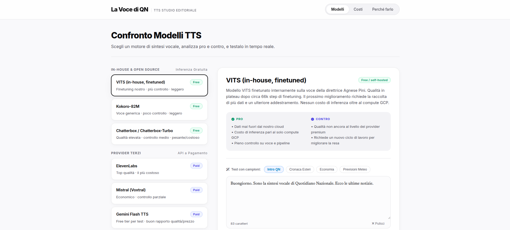

# La Voce di QN

A FastAPI demo app for comparing text-to-speech models in an **editorial newsroom context** — reading Italian news articles aloud. Built to evaluate self-hosted and third-party TTS options for Quotidiano Nazionale / Il Resto del Carlino, from an in-house finetuned voice model to commercial APIs.

Inspired by and based on [vits-finetuning-news-it](https://github.com/n1kg0r/vits-finetuning-news-it).



---

## Live demo (pre-generated samples)

A static version with pre-made audio samples for every model is deployed via GitHub Pages from the `gh-pages` branch:

**[[La Voce di QN Demo (Static)](https://nikogorbachev.github.io/la-voce-demo/)]**

This lets anyone listen to and compare model outputs without installing anything.

---

## App structure — three tabs

1. **Modelli** — side-by-side comparison of every TTS model under evaluation: short description, pros/cons, license, and a live text-to-speech workspace. Self-hosted models (VITS, Kokoro, Chatterbox) run in-browser against the local FastAPI backend; third-party models (ElevenLabs, Mistral/Voxtral, Cartesia, Gemini) are wired to return a clear "not configured" message until an API key is added.
2. **Costi** — real per-article and monthly cost breakdowns for every model, using actual GCP on-demand compute pricing for self-hosted options and official per-character/per-token rates for third-party APIs.
3. **Perché farlo** — the accessibility and business case for investing in TTS, backed by sourced Italian literacy/readership statistics (OCSE PIAAC, ISTAT, OCSE PISA).

---

## Models compared

### Self-hosted / open source

- **VITS (in-house, finetuned)** — see [VITS model details](#vits-in-house-model-details) below. Our own cloned-voice checkpoint; free inference beyond GCP compute.
- **Kokoro-82M** — Apache 2.0, ~82M parameters, supports Italian, no voice cloning. Lightweight and fast on CPU.
- **Chatterbox** — MIT license (Resemble AI), zero-shot voice cloning. Needs >5GB RAM; CPU inference is slow (~30s to synthesize 10s of audio in testing), GPU strongly recommended for production use.

### Third-party providers (require API access)

- **ElevenLabs** — most mature for expressiveness and voice cloning; the most expensive option per character.
- **Mistral (Voxtral)** — cheapest of the paid providers with real voice cloning support.
- **Cartesia (Sonic)** — lowest latency; the only provider here that gates cloning/commercial use behind a paid monthly subscription rather than pure usage-based billing.
- **Gemini (Flash / 2.5 Pro TTS)** — no voice cloning, but a genuinely free tier for testing (Google AI Studio) before enabling billing.

Access to third-party model credentials is managed centrally — **contact the backend team** to get API keys wired into your local `.env` before those tabs will produce real audio instead of the "not configured" message.

---

## Project structure

```bash
lavoce/
├── main.py               # FastAPI backend: routing, normalization, editorial punctuation, TTS synthesis
├── requirements.txt       # dependencies
└── static/
    ├── index.html         # Tab 1: model comparison + TTS workspace
    ├── pricing.html        # Tab 2: cost comparison
    ├── motivation.html     # Tab 3: accessibility/business case
    ├── models-data.js      # model metadata (descriptions, pros/cons, defaults)
    ├── app.js              # dashboard + workspace logic
    └── style.css           # shared styling
```

---

## Running it locally

You can compare the **local, self-hosted models** (VITS, Kokoro, Chatterbox) without any external API access.

1. **Install dependencies:**

```bash
pip install -r requirements.txt
```

2. **Download the VITS checkpoint** (not included in this repo due to size):

```bash
gdown [TODO: add the vits_it_female.pth file ID] --output vits_it_female.pth
gdown [TODO: add the config_it_female.json file ID] --output config_it_female.json
```

3. **Run the server:**

```bash
uvicorn main:app --reload
```

4. **Open the app:**

Navigate to `http://127.0.0.1:8000` — the three tabs (Modelli / Costi / Perché farlo) are all served from there.

5. **Try it out:**

Select a model, paste an article, adjust the normalize/editorial-punctuation toggles (self-hosted models only), and click **Genera Audio**. Use **Vedi testo normalizzato** to preview exactly what text will be sent to the model before synthesizing.

### Third-party models

ElevenLabs, Mistral (Voxtral), Cartesia, and Gemini require API credentials that aren't included in this repo. **Contact the backend team** for access; once keys are added to `main.py` (see `UNCONFIGURED_PROVIDERS`), those tabs will synthesize real audio instead of returning a "not configured" notice.


---

## VITS (in-house) model details

The finetuned checkpoint behind "La Voce di QN" clones the voice of **Agnese Pini** (Director of *Il Resto del Carlino* / *La Nazione*), optimized for daily news reading and podcast-style narration.

**Pipeline history:**

- **Base model:** finetuned on top of Coqui TTS's official pre-trained Italian VITS checkpoint, to inherit its Italian pronunciation and cadence.
- **Cycle 1 (discarded):** initial dataset was auto-transcribed with `whisper-large-v3-turbo`. Whisper's tendency to produce "clean" text while filtering out breaths, coughs, room noise, and hesitations caused the model to hallucinate those acoustic artifacts onto ordinary words during inference.
- **Cycle 2 (current approach):** switched to a hyper-curated, manually annotated dataset (~200 clips, ~60 minutes of pristine audio) using a custom single-character prosody tagging legend, so the model learns artifacts and pauses explicitly rather than inferring them:

  | Symbol | Meaning |
  |---|---|
  | `,` | short pause |
  | `–` (en-dash) | medium pause |
  | `—` (em-dash) | long pause |
  | `_` | extra-long pause |
  | `-` | abrupt cut-off |
  | `£` | coughing |
  | `%` | laughing |
  | `@` | mouth click |
  | `&` | audience noise |
  | `#` | breathing |
  | spelled-out hesitations | e.g. `uhm`, `hmm`, `mmm`, `eee` |

- **Architecture changes:** the text embedding layer (`enc_p.emb.weight`) was resized to add the custom symbols above on top of the existing Italian alphabet; the internal padding token was changed from `_` to `*` so the long-pause symbol wasn't silently ignored during training.
- **Training tuned for a micro-dataset:** lowered `lr_gen`/`lr_disc` to `0.0001` for gentler updates, increased `eval_split_size` to `0.075` for a stable validation curve, and reduced `save_step` to `300` for granular checkpointing.
- **Inference-time punctuation heuristic:** since the underlying engine hard-splits audio at periods, an editorial punctuation pass remaps commas to em dashes and sentence breaks to a `; —` pattern at inference time, producing longer, more natural newsroom-style pauses instead of choppy sentence-by-sentence delivery (see `apply_editorial_punctuation` in `main.py`).
- **Current status:** quality has plateaued around **~66k finetuning steps** — further gains likely need more training data rather than more steps.

---


## Notes

- The app loads one finetuned VITS model (~1GB) into memory at a time — avoid running multiple large models simultaneously on the same instance.
- Chatterbox and Parler-TTS are notably heavier than VITS/Kokoro; CPU-only inference is viable for testing but slow (minutes per article) — see the **Costi** tab for measured/estimated compute costs and a CPU-vs-GPU breakdown.

---

## References

- [VITS Italian news finetuning repository](https://github.com/nikgorbachev/vits-finetuning-news-it)